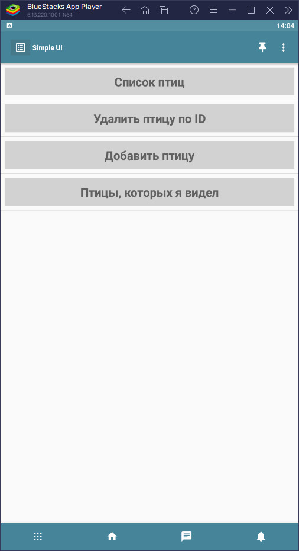
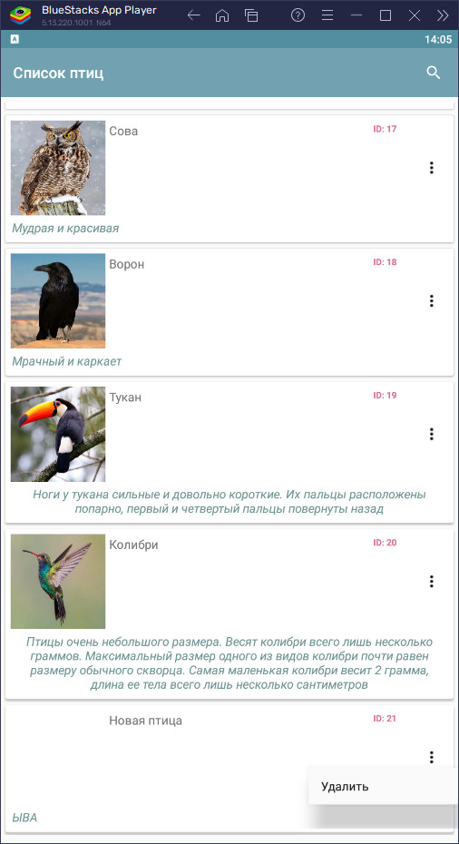
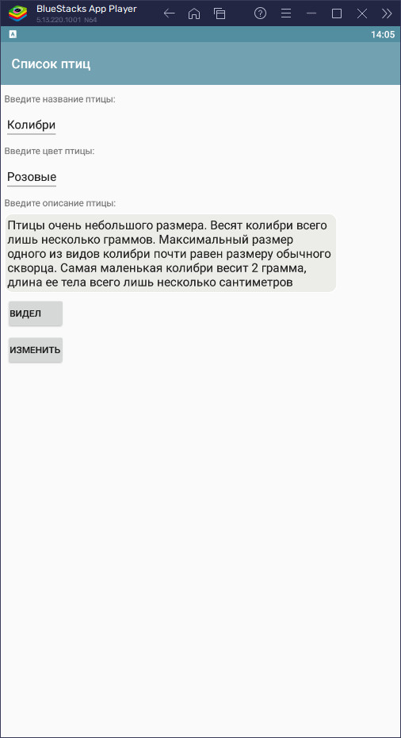
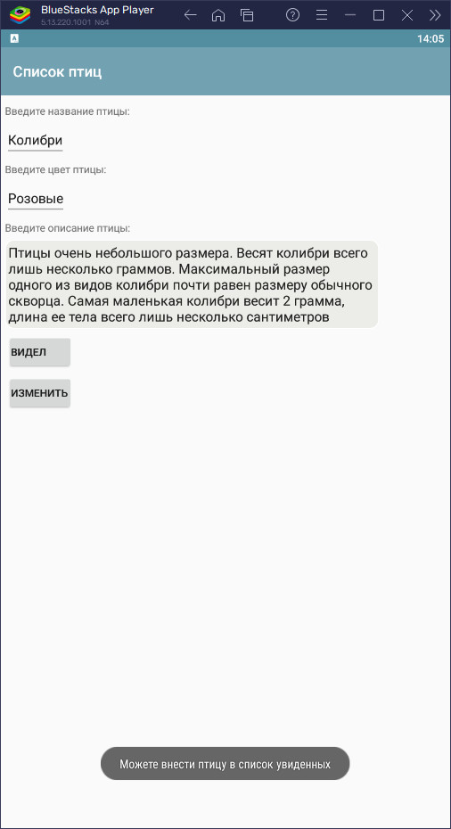
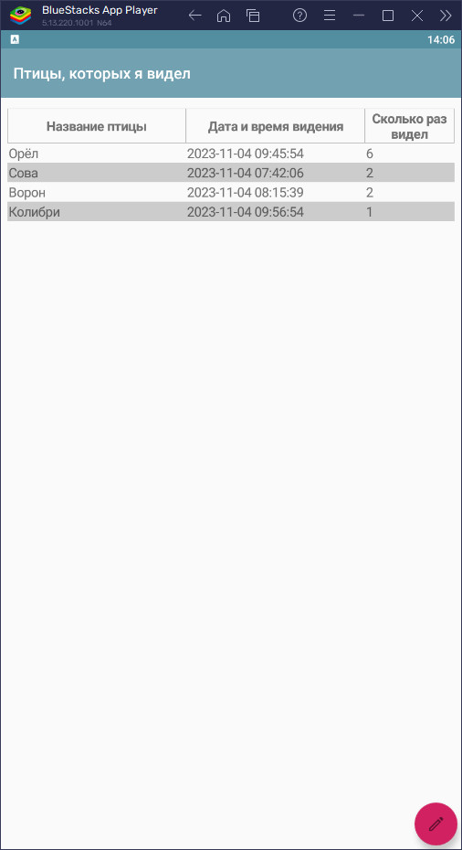
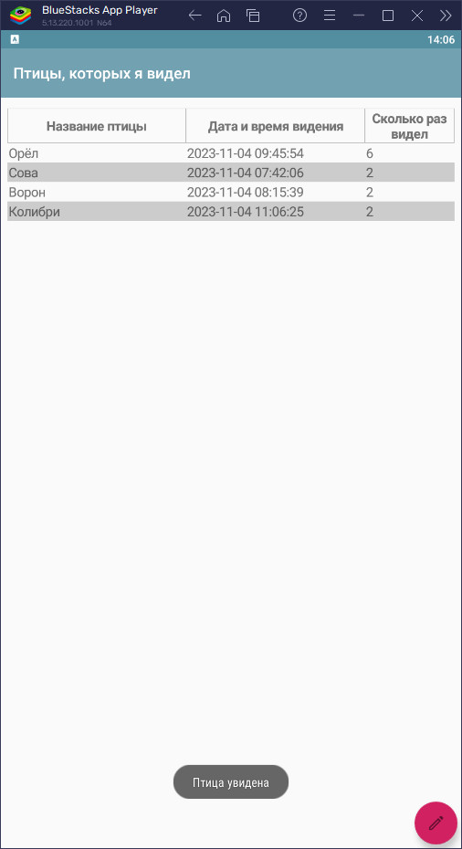
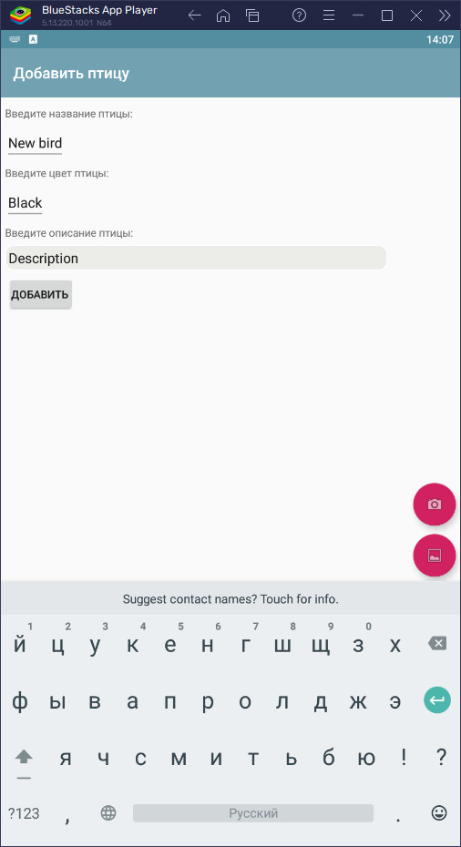

# Тестовое задание "Птицы", используя инструменты Simple UI.

На данной странице размещены файлы для мобильной версии программы.  
Веб версию можно посмотреть [тут](http://92.63.176.87:1555/) или развернуть локально.  

### Известные баги web версии: ###  
* Не подргужаются картинки из базы данных, хотя в базе данных они есть. Это связано с тем, что на уровне библиотеки uiweb в html тег добавляется "/static/", но у меня реализовано отображение base64 картинки.
* Невозможно получить данные или изменить карточку птицы в списке карточек. Это связано с тем, что в web версии (в мобильной всё работает) в переменные "card_data" и "selected_card_key" ничего не падает при наступлении события "CardsClick".

**Если хотите воспользоваться приложением мобильной версии с уже наполненной базой данных (как на скриншоте),**  
**Скопируйте файл birds  на устройство по пути "//data/data/ru.travelfood.simple_ui/databases/birds""**

### Скриншоты работы проекта: ###

